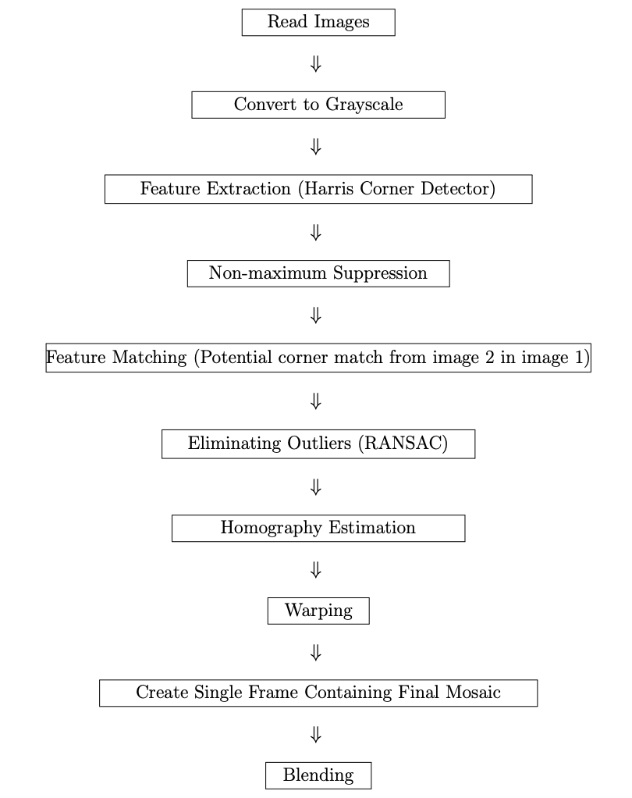

# Image-Mosaicing

## Description 
This project generates an image mosaic/ panorama from images. The following are the sequence of steps of the process




## Dependencies
OpenCV
NumPy

## How to Run 

Run the utility from the command line, as follows:

```bash 
python mosaic.py -p <image> -t <tiles directory>
``` 
The image argument should contain the path to the image for which you want to build the mosaic
The tiles directory argument should contain the path to the directory containing the tile images (the directory will be searched recursively, so it doesn't matter if some of the images are contained in sub-directories)

For example:

```bash
python mosaic.py game_of_thrones_poster.jpg /home/admin/images/screenshots
```

## Image Mosaic Examples

We first convert images to gray scale. Next, we detect corners from both images as descriptive features. For this purpose we detect the corners using
Harris corner detector with k = 0.04. We used Sobel filter to obtain gradients of images with a window of size 3 ×3. And then we apply non-max
suppression (NMS) with a maximum distance of 10 (approximately 7 ×7 window size). Fig.2 shows corners detected in image 1 and image 2 after applying NMS.

Feature matching using NCC: In the next step, we match the the extracted features in the two images using Normalized Cross Correlation (NCC) with a threshold equal to 0.9. For each corner detected in image 1, we search its correspondence in image 2. We perform template matching between patches of both images, where we construct a patch by considering neighbor pixels in a window with corner as the center pixel. The correlation coefficient between patches is taken as metric to the measure potential match.


RANSAC: This list however, contains errors(outliers) that are then han-
dled using RANSAC. In each iteration (we used N = 1000) four points are
randomly selected from the list and a homography is estimated using the four
points. Among all the iterations, the list containing the maximum number
of inliers is selected and outliers are eliminated. Finally a homography is
estimated using all the inliers. Using the estimated homography, we warp
image 1 into the coordinate system of image 2 and create the final using
blending. The mapping between two projection planes with the same center of projection called Homography.
We can see in the Fig.4 after performing RANSAC, that the outliers have
been eliminated and we are left with a smaller but error-less list of features.
Figure 4: Matched corners with inliers in images 1 and 2 after RANSAC
We can see in the fig.5 the warped image of image 1 and 2.
10

